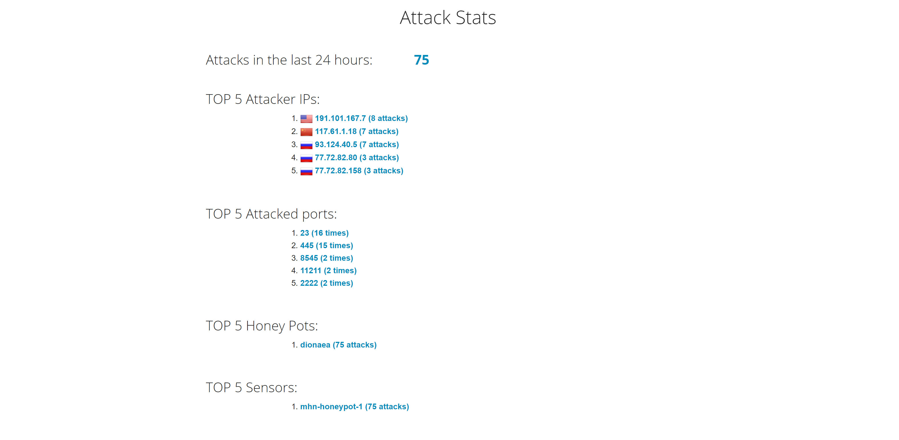

# Week 9 - Honey Pot

Time spent: **10** hours spent in total 

# Honey Pot(s) Used
I only used Dionaea and I tried to used eleastic honey but that results in some issues as described below.

# Issues
  Some issues I faced were getting the external IPS to appear in my browser and after reading the discussion page I was able to solve this problem. Also I had to download each vm instance multiple times because it took a long time and I forgot to check up on it and then the connection would get disrupted so I had to start again which is another reason it took so long. Another issue I faced was that when I tried to add another honeypot my admin dashboard stopped showing up and everything became realy slow so I deleted that instnace and a reason why my number of attacks is so low because I had to restart the mhn admin. 
  
  # Summary
  The following picture describes all the attacks and a ittle more break down of what happened. Also the session.json file is in the repo right [here](session.json)

  

# Other Questions
  
  I was wondering why I had so many ports open when in the tutorial there were only three ports open and how can I reduce my number of ports or was the tutorial just showing a snipet?
  
